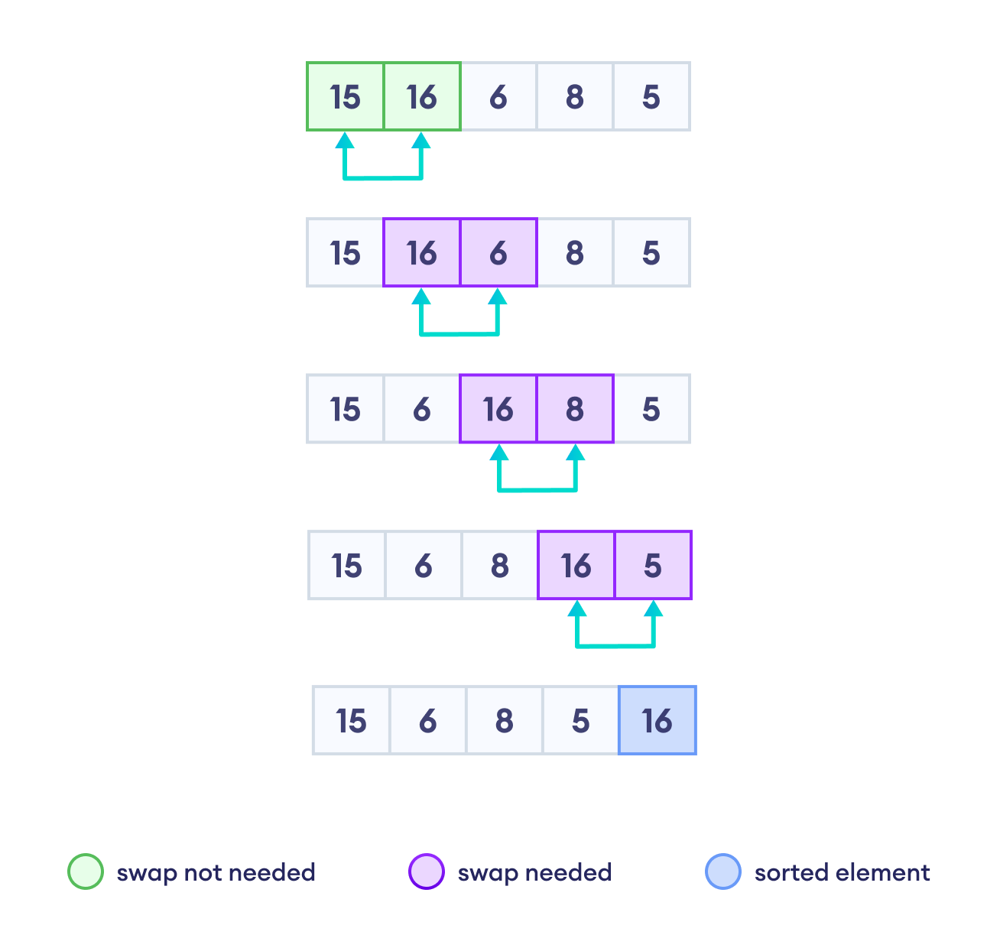

## Bubble Sort

- Iterate through the vector, comparing each pair of adjacent elements.
- Swap the elements if the preceding element is greater than the next element.
- Repeat this process for each element until the vector is sorted.

  


```cpp
void bubbleSort(int arr[], int n) {
    for (int i = 0; i < n-1; i++) {       // Outer loop
        for (int j = 0; j < n-i-1; j++) { // Inner loop
            if (arr[j] > arr[j+1]) {      // Comparison
                int temp = arr[j];        // Swap
                arr[j] = arr[j+1];
                arr[j+1] = temp;
            }
        }
    }
}

```

### Time Complexity Analysis:

### 1. **Worst Case (Reverse Sorted Array):**

In the worst case, the array is sorted in reverse order. The algorithm must perform the maximum number of comparisons and swaps:

- **Outer loop**: Runs `n-1` times.
- **Inner loop**: On the first pass, it performs `n-1` comparisons, on the second pass `n-2`, and so on until 1 comparison is made on the last pass.

  The total number of comparisons in the worst case is:

  $$
  Total Comparisons= (n−1)+(n−2)+⋯+1=2(n−1)×n
  $$

  This is an arithmetic series sum, which simplifies to:

  $$
  Total Comparisons = (n^2 - n)/2
  $$


### 2. **Best Case (Already Sorted Array):**

In the best case, the array is already sorted. An optimized version of Bubble Sort would include a flag to detect if a swap was made during a pass. If no swaps are made, the array is already sorted, and the algorithm can terminate early.

- **Outer loop**: Runs `n-1` times.
- **Inner loop**: Still performs comparisons, but no swaps are necessary.

In the best case, if the optimized version is used, the inner loop breaks early:

- **Time Complexity**:  $O(n)$ due to the early termination.

### 3. **Average Case:**

In the average case, the array is neither sorted nor reverse sorted, and the algorithm performs a number of comparisons and swaps somewhere between the best and worst cases.

- The average time complexity is still dominated by quadratic term:

  **Time Complexity** = $O(n^2)$


### Summary:

- **Worst Case Time Complexity**: $O(n^2)$
- **Best Case Time Complexity**: $O(n)$ (with optimization, otherwise $O(n^2)$)
- **Average Case Time Complexity**: $O(n^2)$

The space complexity of Bubble Sort is $O(1)$, since it only requires a constant amount of extra space.

---
